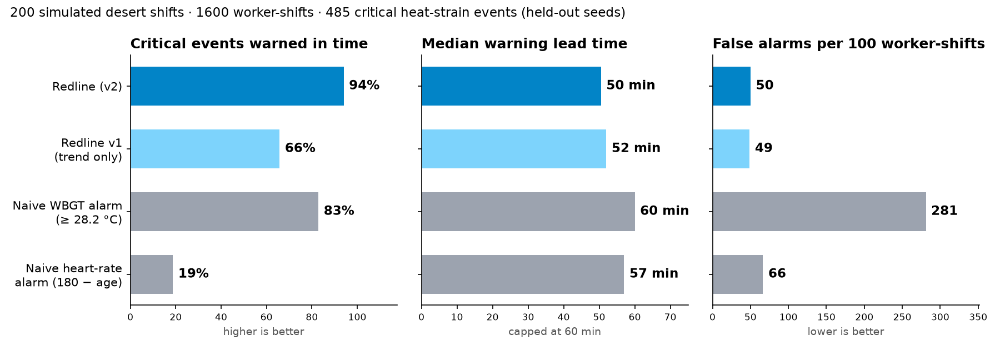
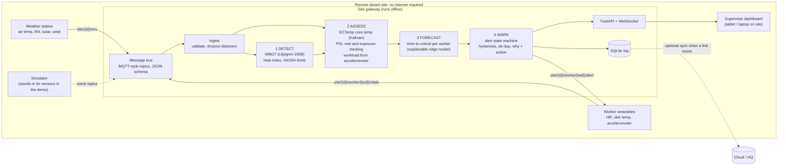

# GrandHeck: a personal heat-strain forecaster

> **Standard alarms tell you it's hot. We tell you which worker will be in danger, and when, before they feel it.**

GrandHeck watches a crew of outdoor workers at a remote desert site. For **each worker** it estimates core body temperature from a wearable heart-rate stream. It then forecasts **how many minutes remain until they reach dangerous heat strain if they keep working as they are**, and it warns them and their supervisor *before* that happens. Every alert says why it fired and what to do. The alert logic runs on a site gateway with **no internet connection**.



On 200 held-out simulated shifts (1,600 worker-shifts, 485 critical events), GrandHeck warned before **94%** of critical heat-strain events, a median **50 minutes** ahead. It raised **5.6× fewer false alarms** than a fixed WBGT alarm (50 vs. 281 per 100 worker-shifts). [Details and caveats are below.](#evaluation-results)

---

## Contents

1. [The problem](#the-problem)
2. [Architecture](#architecture)
3. [How each pipeline stage works](#how-each-pipeline-stage-works)
4. [The science, with citations](#the-science-with-citations)
5. [Running it](#running-it)
6. [Message schema](#message-schema)
7. [3-minute demo script](#3-minute-demo-script)
8. [Evaluation results](#evaluation-results)
9. [Limitations and what we would do next](#limitations-and-what-we-would-do-next)
10. [Repository layout](#repository-layout)

---

## The problem

In deserts, offshore and in disaster zones, heat conditions change fast and medical help is far away. Exertional heat illness can go from "fine" to heat stroke within an hour. The usual safety tools have two problems:

- **Site-wide heat alarms** (WBGT flags, heat index) say *the site* is hot. They fire for everyone at once, all afternoon, so crews learn to ignore them. They don't know that the new hire on heavy work is in far more danger than the acclimatized surveyor.
- **Personal heart-rate limits** fire too late or never. Heart rate alone is a poor guide to core temperature.

The challenge pipeline is **Monitor the environment → Detect stress → Assess human exposure → Issue an early warning**. GrandHeck implements every stage, and puts most of its care into exposure assessment and forecasting.

---

## Architecture



**Design choices**

- **Offline first.** Nothing in the pipeline calls the network. The gateway keeps working when the satellite link drops, which is the normal state at a remote site. The demo runs everything on one laptop, but it's the same process you would deploy on a site gateway (any small x86/ARM box).
- **Sensor-agnostic.** The pipeline only talks to the bus. A real weather station or wearable plugs in by publishing the [JSON schema](#message-schema) on the documented topics, either through an MQTT broker adapter or the `POST /api/ingest/{topic}` HTTP bridge. No pipeline code changes.
- **One code path.** The live demo, the tests and the evaluation all run the same `Gateway` class, so the numbers on the slide come from the code you see running.

---

## How each pipeline stage works

### 1. Monitor
The weather station sends air temperature, relative humidity, solar radiation and wind speed once a minute. Each wearable sends heart rate, skin temperature and an accelerometer activity index. Messages are validated against Pydantic models (`backend/grandheck/schema.py`). Invalid messages are counted and dropped; they never crash the gateway.

**Missing data is shown, never hidden.**
- No vitals for 3 minutes: the worker's card turns to a hatched **NO SIGNAL** state. A `signal_lost` alert tells the supervisor to check on the worker in person. The worker's alert tier is **frozen, never lowered**, because we can't know they got better.
- The core-temperature filter keeps predicting during gaps, with growing uncertainty. Gaps are left empty in the history, never filled in, and the forecaster refuses to forecast from too little real data.
- If the solar sensor drops out, the last good reading is held for up to 30 minutes, with a "solar held" badge in the UI. After that, WBGT falls back to a shade-only formula, with a "shade estimate" badge.

### 2. Detect environmental stress
- **WBGT** is estimated with the **Liljegren et al. (2008)** model. It solves heat balances for a black globe and a natural wet-bulb wick, using the sun's real position for the site and time.
- **Heat index** (NWS Rothfusz regression) is shown alongside for comparison. It ignores sun and wind, so in the desert it reads very differently from WBGT.
- **Workload-dependent limits** come from **NIOSH (2016)**: the REL (acclimatized) and RAL (unacclimatized) as continuous functions of metabolic rate. The environment is classified per workload as *low* (below RAL), *elevated* (RAL–REL) or *high* (above REL).

### 3. Assess human exposure (the core of the project)
- **Core temperature** comes from heart rate via **ECTemp** (Buller et al., 2013): a one-state extended Kalman filter, updated every minute.
- **Physiological Strain Index** follows **Moran et al. (1998)**, using each worker's resting heart rate as the baseline.
- **Rest tracking:** a rest bout is at least 10 minutes of low activity, using the median of the last 3 readings so one jolt doesn't cancel a break.
- **Cumulative exposure:** minutes worked with WBGT above the worker's own limit, both in total and since the last rest.
- **Workload** is **inferred from the accelerometer**. A worker reassigned from moderate to heavy work is noticed even though their profile says "moderate".
- **The profile adjusts risk:**
  - Acclimatization sets the core limit (38.5 °C vs 38.0 °C, ACGIH) and the WBGT limit (REL vs RAL, NIOSH).
  - Age 45+ gets warned 10 minutes earlier.
  - Profile risk factors appear in the alert reasons.

### 4. Early warning
**Forecaster v2** (`backend/grandheck/pipeline/model.py`) is a small **ridge regression** that sits on top of ECTemp.

- **Inputs** are only what the gateway observes:
  - the ECTemp estimate and its trend
  - heart rate and how fast it's rising
  - PSI
  - WBGT above the worker's own limit, and how fast WBGT is rising
  - working or resting, and time since rest
  - workload, acclimatization, age band, and how long the filter has been running
- **Output:** one linear model per horizon (0, 10, 20, 30, 45, 60 minutes). Each predicts the worker's true core temperature **if they keep working as they are now**.
- **Why it's needed:** ECTemp is deliberately slow-moving. When core temperature climbs fast (a new worker on heavy work in strong heat), the estimate lags. v2 uses environment and profile inputs to anticipate the climb.
- **Warns on risk, not the average.** Advisory and Warning fire when the *risk edge* (forecast + 0.5 × that horizon's validation error) reaches the danger line. **Critical** is reserved for the central forecast within 5 minutes, or the limit actually reached.
- **Beyond 60 minutes,** the v1 straight-line trend extrapolation supplies the longer-range estimate. **v1** is kept as a fallback and as a comparison in the evaluation.

**Alert tiers.** The thresholds below are design choices, not health thresholds.

| Tier | Fires when | Action given (NIOSH/OSHA guidance) |
|---|---|---|
| Advisory | forecast critical within 45 min, **or** 60+ min above own WBGT limit without a break | Drink ~240 ml water now and every 15–20 min; buddy check; next break in shade |
| Warning | forecast critical within 20 min | Stop strenuous work, rest in shade, drink water; supervisor check |
| Critical | central forecast within 5 min, or estimate already at the limit | Stop work, active cooling, don't leave the worker alone; if confused or collapsed, treat as heat stroke |

**Every alert states why it fired,** with the top contributing factors ranked by magnitude, for example *"WBGT 33.1 °C, 6.5 °C over limit for heavy work · 72 min without rest · Core temp rising +0.9 °C/h"*.

**The state machine (`pipeline/alerts.py`) stops alerts from flapping:**
- **Escalation** needs 3 consecutive minutes at the higher tier.
- **De-escalation** needs 5 minutes *and* a 10-minute margin past the tier's limit.
- **One event per tier change,** plus a re-notification every 15 minutes while a Warning or Critical persists.

---

## The science, with citations

Every threshold and constant lives in **one file, `backend/grandheck/config.py`**, and each one carries its source. Values marked `DESIGN` are engineering choices (alert timing, smoothing), not health thresholds.

| What | Method / value | Source |
|---|---|---|
| Outdoor WBGT | 0.7·T<sub>nwb</sub> + 0.2·T<sub>g</sub> + 0.1·T<sub>a</sub> | ISO 7243:2017 |
| Natural wet bulb and globe temperature | Iterative energy-balance model from standard met data | Liljegren JC et al. (2008), *J Occup Environ Hyg* 5:645–655 |
| WBGT fallback (no sun/wind data) | 0.567·T<sub>a</sub> + 0.393·e + 3.94 | Australian Bureau of Meteorology |
| Heat index | Rothfusz regression + Steadman adjustments | NWS Weather Prediction Center |
| WBGT limits | RAL = 59.9 − 14.1·log₁₀M; REL = 56.7 − 11.5·log₁₀M | NIOSH (2016) Criteria for a Recommended Standard, Pub. 2016-106 |
| Metabolic rate by workload | rest 115, light 180, moderate 300, heavy 415 W | ACGIH TLV (cf. ISO 8996) |
| Core temp from HR | Extended Kalman filter, a=1, γ²=0.022², HR = −4.5714·CT² + 384.4286·CT − 7887.1, σ²=18.88² | Buller MJ et al. (2013), *Physiol Meas* 34:781–798 |
| Physiological Strain Index | 5·(T<sub>c</sub>−T<sub>c0</sub>)/(39.5−T<sub>c0</sub>) + 5·(HR−HR₀)/(180−HR₀) | Moran DS et al. (1998), *Am J Physiol* 275:R129–R134 |
| Core temperature limit | 38.5 °C acclimatized / 38.0 °C unacclimatized | ACGIH TLV for heat stress and strain |
| Heart-rate criterion (baseline alarm) | sustained HR > 180 − age | ACGIH TLV |
| Hydration guidance | ~1 cup (240 ml) every 15–20 min | NIOSH (2016); OSHA Technical Manual III:4 |

**Our implementation is checked against independent references:**
- With no sun, the Liljegren natural wet bulb matches Stull's (2011) psychrometric formula to within 1 °C.
- The heat index matches the NWS table to within 1.5 °F.
- ECTemp reproduces the published HR–core curve.

### Before the demo: values to verify

Run `cd backend && ../.venv/Scripts/python -m grandheck.config` to list every `TODO(verify)`. These need checking against the primary sources:

- [ ] ECTemp parameters (a, γ, b0–b2, σ) against Buller et al. (2013)
- [ ] ACGIH core limits (38.5 / 38.0 °C) and metabolic-rate classes against the current TLV documentation
- [ ] PSI ≥ 7 as the Critical cutoff ("high strain" in Moran 1998)
- [ ] "Sustained" HR duration for the HR baseline (we use 5 min; ACGIH says "several minutes")
- [ ] Ground albedo for desert sand in the Liljegren model (we use 0.45; sand may be ~0.3–0.4)
- [ ] Accelerometer activity → workload bands (must be calibrated for the real wearable)
- [ ] Rest duration to state in the Warning action (NIOSH work/rest tables)

---

## Running it

**Requirements:** Python 3.10+ and Node.js 20+ (Node is needed only to build the dashboard the first time).

```bash
python run.py
```

The first run creates `.venv/`, installs Python packages, builds the dashboard and opens **http://localhost:8000**. Later runs start in about 2 seconds and need no internet.

| Command | What it does |
|---|---|
| `python run.py` | Start the gateway and dashboard (`--port 9000`, `--no-browser`) |
| `python run.py test` | Run the unit tests (67 tests) |
| `python run.py eval` | Run the evaluation (200 shifts, about 1 min); writes `docs/results/` |
| `docker compose up` | Optional container build of the same thing on port 8000 |

To retrain forecaster v2 (about 2 min): `cd backend && ../.venv/Scripts/python -m eval.train_forecaster`. To sweep the risk parameter on validation seeds: `../.venv/Scripts/python -m eval.evaluate --tuning`.

For frontend development, run `python run.py` in one terminal and `cd frontend && npm run dev` in another (Vite on :5173, proxied to the gateway).

**API**

| Endpoint | Purpose |
|---|---|
| `GET /api/state` | Run settings, crew, thresholds |
| `POST /api/control` | `{"action": "reset" \| "pause" \| "resume" \| "speed" \| "step" \| "weather" \| "spike" \| "dropout" \| "rest", ...}` |
| `POST /api/ingest/{topic}` | Publish one sensor message (HTTP bridge for real devices) |
| `WS /ws` | `init` snapshot, then one `tick` per simulated minute |

---

## Message schema

Topics follow MQTT conventions. Any field a sensor couldn't measure may be `null`.

| Topic | Direction | Body |
|---|---|---|
| `site/{site_id}/env` | weather station → gateway | `grandheck.env.v1` |
| `site/{site_id}/worker/{worker_id}/vitals` | wearable → gateway | `grandheck.vitals.v1` |
| `site/{site_id}/worker/{worker_id}/alert` | gateway → wearable / UI | `grandheck.alert.v1` |

```jsonc
// site/desert-01/env
{
  "schema": "grandheck.env.v1",
  "site_id": "desert-01",
  "ts": "2026-07-15T13:05:00+04:00",   // ISO 8601 with offset
  "air_temp_c": 43.2,
  "rh_pct": 17.0,
  "solar_wm2": 1012.0,                 // global horizontal irradiance; null if the pyranometer is down
  "wind_ms": 2.4,                      // at ~2 m
  "pressure_hpa": 1008.0               // optional
}

// site/desert-01/worker/W3/vitals
{
  "schema": "grandheck.vitals.v1",
  "site_id": "desert-01",
  "worker_id": "W3",
  "ts": "2026-07-15T13:05:00+04:00",
  "hr_bpm": 142.0,
  "skin_temp_c": 35.9,
  "activity": 0.81,                    // accelerometer activity index, 0 = still, 1 = max
  "battery_pct": 71.0                  // optional
}

// site/desert-01/worker/W3/alert
{
  "schema": "grandheck.alert.v1",
  "site_id": "desert-01",
  "worker_id": "W3",
  "ts": "2026-07-15T13:05:00+04:00",
  "level": "WARNING",                  // NONE | ADVISORY | WARNING | CRITICAL
  "kind": "escalated",                 // escalated | renotify | resolved | signal_lost | signal_restored
  "ttc_min": 17.5,                     // forecast minutes to critical strain
  "reasons": ["WBGT 33.1 °C, 10.1 °C over limit for heavy work", "Heart rate up 21 bpm in 15 min"],
  "action": "Stop strenuous work now. Rest in shade or a cooled shelter and drink water. ..."
}
```

Worker profiles (`WorkerProfile` in `schema.py`) hold: `worker_id`, `name`, `role`, `age`, `acclimatized`, assigned `workload`, and optional `resting_hr` from a pre-shift check.

---

## 3-minute demo script

**Setup before going on stage:** run `python run.py` and maximise the browser. The simulator uses a fixed seed, so this sequence plays out the same way every time.

| Time | Click | What the audience sees / what you say |
|---|---|---|
| 0:00 | **New shift → Normal hot day** (from 07:00), speed **2×** | "A desert site at 7 a.m. with eight workers. Each wearable sends heart rate and motion; the weather station sends temperature, humidity, sun and wind." Point at the top bar: WBGT (Liljegren) vs. heat index, and the category for moderate work. |
| 0:20 | Wait until ~07:13 | **Daniel Okafor** (new this week, heavy labour) turns **WARNING**, with a countdown. "Nobody here feels unwell yet. We're warning about Daniel specifically, not the whole site." |
| 0:35 | **Click Daniel's card** | Drill-down: estimated core temperature (blue), forecast (orange dashed) and risk edge (dotted) heading for his **38.0 °C** limit (lower, because he's not acclimatized). Read the **Why** line and the **Do** line. |
| 0:55 | Tick **show simulator ground truth** | The grey line is his *true* core temperature, which the system never sees. "We warned at 07:13. His real core temperature crosses the limit at about 08:08. That's 55 minutes of warning." Let it run to ~08:05 at **5×** to show the crossing. |
| 1:20 | Speed **2×**; **Send to rest** (Daniel selected) | Daniel's core temperature turns down; after a few minutes the alert eases. It doesn't flap on and off (hysteresis). |
| 1:40 | Select **Ravi Menon** → **Sensor dropout** | Ravi's card goes to hatched **NO SIGNAL**, a SIGNAL LOST alert says "check on the worker in person", and the WBGT tile shows **solar held**. "Missing data is shown, never treated as safe." |
| 2:00 | **Heat surge now**, speed **5×** | A humid sea breeze arrives and WBGT climbs. **Li Wei** (new electrician) goes to **WARNING** around 09:04, before his true crossing around 09:13. Older riggers get Advisories at different times. "Same site, same heat, different people, different times." |
| 2:30 | Point at the alert feed | Each alert is one line of **why** and one line of **what to do**. Advisories are hidden by default so the feed stays readable. |
| 2:40 | Show `docs/results/results_chart.png` | "Over 200 simulated shifts we warned before 94% of critical events, a median 50 minutes ahead, with 5.6× fewer false alarms than a WBGT alarm. And it all runs offline on a box at the site." |

**Fallback:** if anything misbehaves, click **New shift → Normal hot day** to restart from a known state. **Pause** and **+1 min** let you step through slowly while you talk.

---

## Evaluation results

`python run.py eval` (`backend/eval/evaluate.py`) runs **200 randomised shifts** on **held-out seeds (≥ 1000)**. Each shift has a random 8-person crew, jittered weather (either profile), and random live events: heavy-work-no-rest spikes and sensor dropouts. Workers are *not* sent to rest by the system during evaluation; we measure the natural course.

**Definitions**

- **Critical event:** the first minute a worker's *hidden* simulated core temperature reaches their ACGIH limit. No system sees this value.
- **Warned in time:** an alarm was active during the 60 minutes before the event.
- **Lead time:** the event minus that alarm's onset, capped at 60 minutes.
- **False alarm:** an alarm episode not followed by that worker's event within 60 minutes.

**Baselines**

- **Naive WBGT:** fires for everyone when site WBGT ≥ 28.2 °C (the NIOSH REL for moderate work).
- **Naive heart rate:** HR > 180 − age, sustained for 5 minutes (ACGIH).

| System | Warned in time | Median lead (min) | Missed | False alarms / 100 worker-shifts | Alarm precision | Never-in-danger workers alarmed |
|---|---|---|---|---|---|---|
| **GrandHeck v2 (Warning+)** | **456 / 485 (94%)** | **50** | **29** | **50.1** | **34%** | **15%** |
| GrandHeck v2 (Advisory+) | 484 (100%) | 60 | 1 | 166.1 | 10% | 42% |
| GrandHeck v1, trend only | 319 (66%) | 52 | 166 | 48.9 | 32% | 15% |
| Naive WBGT alarm (≥ 28.2 °C) | 402 (83%) | 60 | 83 | 281.1 | 6% | 100% |
| Naive heart-rate alarm | 91 (19%) | 57 | 394 | 66.5 | 10% | 15% |

ECTemp's core-temperature error against the hidden truth is **0.24 °C RMSE**, in line with the ~0.3 °C reported for ECTemp in field validation.

**How to read this**

- **The WBGT alarm's high lead time is an artefact.** It switches on mid-morning for everyone and stays on, so it's "early" for the people who get hot and wrong for everyone else. It alarmed 100% of workers who were never in danger.
- **GrandHeck matches or beats its detection** (94% vs. 83%) while alarming only 15% of those workers. It also names the worker and the time.
- **The HR-only alarm mostly fires too late or never.** Heart rate alone is a poor proxy for core temperature.
- **v1 → v2 is what forecasting from the environment and the worker's profile buys.** Detection rises from 66% to 94% at about the same false-alarm rate.

**How v2 was built without peeking at the test set**

- **Seeds:** trained on seeds 0–299, with its one tuning knob (risk z = 0.5) chosen on validation seeds 300–399. The evaluation uses seeds 1000+.
- **Validation error** of the predicted core temperature 30 minutes ahead (if work continues unchanged):

| | Error (°C RMSE) |
|---|---|
| v2 | 0.13 |
| v1 straight-line trend | 0.38 |
| ECTemp alone | 0.33 |

- **Trade-off on validation seeds** for the risk parameter z:

| z | Detected | Median lead (min) | False alarms / 100 worker-shifts |
|---|---|---|---|
| 0 | 85% | 48 | 48 |
| **0.5 (chosen)** | **94%** | **57** | **56** |
| 1.0 | 97% | 60 | 65 |

---

## Limitations and what we would do next

- **Results come from simulation.** The simulator's "true" core temperature comes from a simplified heat-balance model, and simulated heart rate deliberately departs from ECTemp's assumptions (per-person offsets and slopes, workload effects, cardiovascular drift, exertion bursts, noise), so the estimator isn't graded on its own assumptions.
- **v2 is tuned to that simulator.** v2 learned from simulated bodies, so its advantage here is an upper bound. The training script is built to be re-run on field data (wearable HR plus reference core temperature, e.g. ingestible pills) before any real deployment.
- **Some workers are hard to read from heart rate.** Someone whose heart rate runs low for their core temperature is read too cool; this is where most of the 29 misses come from. The Advisory tier still catches nearly all of them (100%), which is why it exists.
- **The WBGT model has simplifications.** Wind is assumed to be measured at ~2 m (the reference code's stability-class height correction is skipped), and the ground albedo needs a value for local sand.
- **Next steps:**
  - Per-worker calibration of the ECTemp offset from a short pre-shift test
  - Real MQTT broker adapter
  - Haptic alerts on the wearable
  - Wet-bulb sensor cross-check

---

## Repository layout

```
run.py                         one-command launcher (setup, build, serve, test, eval)
backend/
  grandheck/
    config.py                  every threshold and constant, with citations / TODO(verify) / DESIGN
    schema.py                  message models and topics
    bus.py                     in-process MQTT-style pub/sub
    science/                   wbgt.py, heat_index.py, limits.py, ectemp.py, psi.py
    pipeline/
      gateway.py               the Monitor -> Detect -> Assess -> Warn loop
      forecaster.py            v1 trend forecast, combination with v2, alert reasons
      model.py                 v2 ridge model (+ forecaster_v2.json, the trained weights)
      alerts.py                tiered alert state machine
    sim/                       weather.py, physiology.py (hidden truth), crew.py, engine.py
    api/                       runner.py (demo loop, SQLite log), server.py (FastAPI)
  eval/                        evaluate.py, train_forecaster.py
  tests/                       67 unit tests: science, forecaster, model, alerts, gateway
frontend/src/                  React + TypeScript dashboard (Recharts)
docs/results/                  results.md, results.json, results_chart.png
Dockerfile, docker-compose.yml optional container build
```
